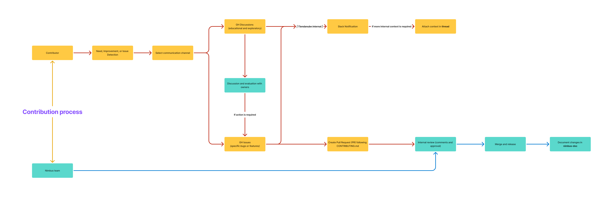

# 🙌 Contributing to Nimbus

First of all, **thank you** 🤜🏻💥🤛🏽 for taking the time to contribute to our project!

Feel free to check our contribution flow below to understand the process your contribution will follow:



Here's how you can contribute to Nimbus:

## 🐛 Reporting a bug

Did you find a bug in one of our components? Please follow these steps:

- Make sure the bug was not already reported by searching on Github under [Issues](https://github.com/TiendaNube/nimbus-design-system/issues).
- If you were unable to find an issue reporting the bug, [create a new one](https://github.com/TiendaNube/nimbus-design-system/issues/new?assignees=juanchigallego%2C+diegopsilverio%2C+gabifagundes%2C+juniorconquista&labels=bug&template=BUG_REPORT.md&title=%5BNIMBUS%5D). Please fill out the template with all the required information to help us reproduce your issue.

## 🖌 Requesting a new component or feature

None of our components fulfill the needs of your application or feature? Is a component missing an important feature you need to develop your project? Not a problem! You can request a new component or feature by following these steps:

- First make sure there's actually _no way_ of achieving what you wish by using our existing components. You can verify all properties and features by browsing our [Storybook library](https://tiendanube.github.io/design-system-nimbus/).
- If there's no component to suit your needs, you can request a new one (or a new feature for an existing one) by opening an [Issue](https://github.com/TiendaNube/nimbus-design-system/issues/new?assignees=juanchigallego%2C+diegopsilverio%2C+gabifagundes%2C+juniorconquista&labels=enhancement&template=NEW_REQUEST.md&title=%5BREQUEST%5D). Please take the time to describe thoroughly **what** the component should do, **how** it should look (if you could provide sketches or benchmarks it would help us a lot), and **where** in your interface or product it would be used.

## 💻 Creating new components or fixing bugs

### Creating a new component

When creating a new component, follow these guidelines:

1. **Location and Structure**

   - Place your component in the appropriate folder under `packages/react/src/atomic` or `packages/react/src/composite`
   - Follow the established folder structure:
     ```
     component-name/
     ├── src/
     │   ├── components/              # Optional directory for sub-components
     │   │   └── ComponentNameSubComponentName/
     │   │       ├── index.ts
     │   │       ├── ComponentNameSubComponentName.tsx
     │   │       ├── ComponentNameSubComponentName.spec.tsx
     │   │       ├── ComponentNameSubComponentName.stories.tsx
     │   │       └── ComponentNameSubComponentName.types.ts
     │   ├── index.ts
     │   ├── ComponentName.tsx
     │   ├── ComponentName.spec.tsx
     │   ├── ComponentName.stories.tsx
     │   └── ComponentName.types.ts
     ├── CHANGELOG.md
     ├── package.json
     ├── README.md
     ├── tsconfig.json
     └── webpack.config.ts
     ```

2. **Styling**

   - Use sprinkle CSS inside `@nimbus-ds/styles` internal core package.
   - Create a specific package folder in `packages/core/styles/src/packages`
   - Create a package.css.ts file where all the styles should be created, using `vanilla-extract`
   - Access theme tokens through the `varsThemeBase` import from themes:

     ```ts
     import { varsThemeBase } from "../../../themes";

     // ✅ Correct way - Use varsThemeBase to access tokens
     const styles = {
       color: varsThemeBase.colors.neutral.textLow,
       spacing: varsThemeBase.spacing[1],
       borderRadius: varsThemeBase.shape.border.radius[2],
     };

     // ❌ Incorrect - Don't import tokens directly
     import { tokens } from "../../../themes";
     const styles = {
       color: tokens.colors.neutral100, // Don't do this
       spacing: tokens.space[1], // Don't do this
     };
     ```

     This ensures your styles adapt correctly to different themes. You can see examples of proper token usage in components like:

     - Lists: Using `varsThemeBase.colors.neutral.textLow` for text color
     - Links: Using `varsThemeBase.colors.primary.interactive` for interactive states
     - FileUploader: Using `varsThemeBase.colors.primary.surface` for backgrounds

   - Export styles in `packages/core/styles/src/index.ts`

3. **Documentation**

   - Include comprehensive Storybook stories
   - Document all props and their types
   - Add usage examples
   - Update CHANGELOG.md following our internal Changelog format
   - Ensure docs are correctly generated after running the build:docs script
   - Make sure all component prop interfaces/types:
     - End with 'Props' (e.g., for **ComponentName**: props would be **ComponentNameProps**) for proper documentation generation
     - Are exported to be detected via the Docgen script

4. **Testing**

   - Write Jest unit tests for all component features
   - Ensure accessibility testing is included
   - Maintain test coverage standards

5. **Package Configuration**

   - Only include necessary dependencies in package.json
   - Avoid duplicating dependencies from root package.json
   - Follow semantic versioning
   - **IMPORTANT** Constants declared within the package must be exported in order to be included in the final published build.

6. **External Dependencies Configuration**
   - For both internal and third-party dependencies that are used across multiple packages, they should be added to the webpack external configuration
   - This prevents duplicate bundling and ensures consistent versions
   - To add a new external package:
     1. For internal Nimbus packages, add to `packages/core/webpack/src/config/external.ts` in the `externalPackages` object:
        ```typescript
        export const externalPackages = {
          "@nimbus-ds/your-component": "@nimbus-ds/your-component",
          // ... other packages
        };
        ```
     2. For third-party libraries, add to the `externalLibs` object:
        ```typescript
        export const externalLibs = {
          "library-name": "library-name",
          // ... other libraries
        };
        ```
     3. Consider adding a package to externals if:
        - It's used by multiple components
        - It's a fundamental building block of the design system
        - Bundling it multiple times would be inefficient
        - It's a third-party library that should be provided by the consuming application
     4. Benefits of externalizing:
        - Prevents duplicate bundling of shared code
        - Reduces bundle sizes
        - Ensures consistent versions across the application
        - Allows for better tree-shaking
        - For third-party libraries: allows the consuming application to provide its own version

### Fixing bugs

When fixing a bug:

1. **Issue Reference**

   - Link your PR to the related issue in the issues
   - If no issue exists, create one first or explain the reference

2. **Testing**

   - Add tests that reproduce the bug
   - Ensure fix doesn't break existing functionality
   - Run full test suite before submitting

3. **Documentation**
   - Update documentation if behavior changes
   - Add notes to CHANGELOG.md

### **Changelog Updates**

- Update the component's package-level CHANGELOG.md
- Update @nimbus-ds/components CHANGELOG.md in packages/react/CHANGELOG.md if a component has been updated.
- For repository-level changes (build scripts, configs, etc), update root CHANGELOG.md
- Follow the format:

  ```md
  ## YYYY-MM-DD `version`

  #### 🛠 Breaking changes

  - Breaking changes that require major version bump ([#PR](PR_URL) by [@author](AUTHOR_URL))

  #### 🎉 New features

  - New features that don't break existing functionality ([#PR](PR_URL) by [@author](AUTHOR_URL))

  #### 🐛 Bug fixes

  - Bug fixes and minor updates ([#PR](PR_URL) by [@author](AUTHOR_URL))

  #### 💡 Others

  - Documentation and build process changes ([#PR](PR_URL) by [@author](AUTHOR_URL))

  #### 📚 3rd party library updates

  - Updated `library@version` ([#PR](PR_URL) by [@author](AUTHOR_URL))
  ```

### **Yarn Version Updates**

When updating package versions:

1. Run `yarn bump:check --interactive` to check for version updates
2. For each package:
   - Review the changes carefully
   - Choose appropriate version bump:
     - `patch` for backwards-compatible bug fixes
     - `minor` for new features (backwards-compatible)
     - `major` for breaking changes
   - Decline updates if changes don't warrant a version bump
3. **Important:** Always decline version updates for the root project (`nimbus-design-system`)
4. After confirming version bumps:
   - Update changelogs accordingly
   - Commit version changes

### Pull Request Process

1. Follow our commit message convention
2. Update documentation as needed
3. Ensure all tests pass
4. Request review from maintainers
5. Address review feedback promptly

### Code Style

- Follow TypeScript best practices
- Use functional components
- Maintain consistent naming conventions
- Write clear, self-documenting code
- Include JSDoc comments for complex logic, or small comments for every function that is not self-explanatory by itself
- Avoid deep imports like `@nimbus-ds/styles/packages/atomic` as it's a bad practice in monorepos. You should use the package's main entry point instead

Remember to:

- Keep components focused and single-purpose
- Prioritize accessibility
- Consider backward compatibility
- Write reusable and maintainable code

## 🎨 Publishing icons

To publish new icons, follow these steps:

1. Create a new icon file in the `packages/icons/src/assets` folder
   - Use the `.svg` file format
   - The name should be in lower case and separated by dashes (e.g. `shopping-cart`)
     - The final output name will be `ShoppingCartIcon` (PascalCase, with the word `Icon` at the end)
   - Use a tool like [SVGOMG](https://jakearchibald.github.io/svgomg/) to reduce the code size and optimize the icon
     - The build process will optimize the icon even further. This step is optional, but recommended for consistency in the code.
   - Set the width and height to 16px
2. Build the icons package
   - Run `yarn build:icons`
   - This will generate a new .tsx file in the `packages/icons/tmp` folder
3. Verify the new icon by running the Storybook and importing the icon in some story
   - Run `yarn storybook`
   - Import the icon in a story and verify it renders correctly (e.g. `packages/react/src/atomic/Icon/src/icon.stories.tsx`)
