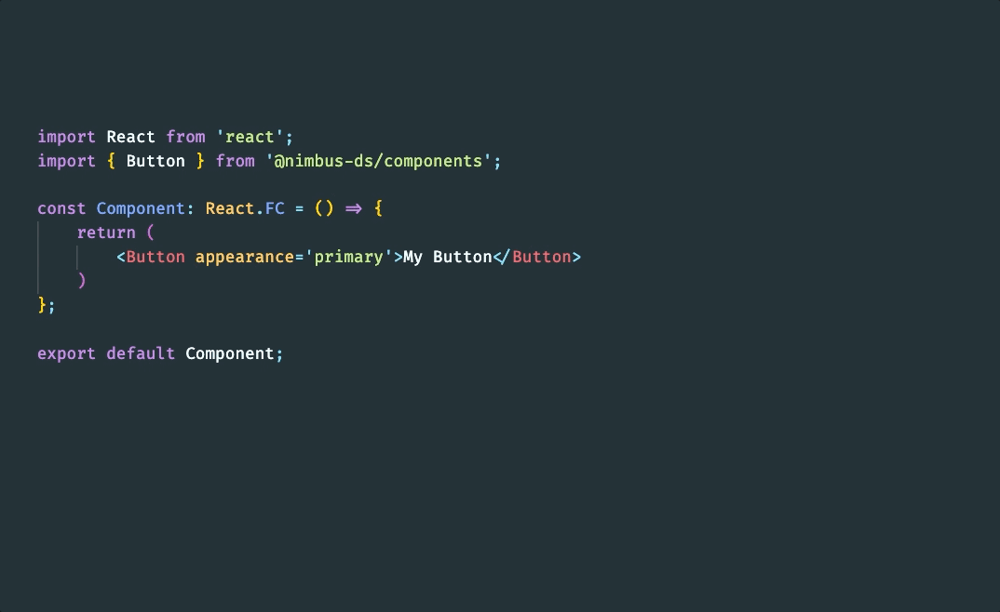

# Nimbus Helper 

> Boost your productivity with **Nimbus Helper**! A magical extension to VS Code that brings complete documentation of all available components and their properties all into your favorite design system. Write stylish code, accelerate development, and break into the programming clouds with the [Nimbus Design System](https://nimbus.nuvemshop.com.br). 💨✨"

## 🗃️ Overview

The **Nimbus Helper** extension is a powerful tool for developers working with VS Code. It is designed to streamline and enhance your workflow, offering advanced and customized features to maximize productivity.

## ✨ Features

- **Real Time Documentation**: Get comprehensive and detailed information about the properties and components of your Design System directly in the editor, providing a more intuitive development.
- **Custom Hover**: View tooltip-style documentation when hovering over components and properties, providing a quick and easy understanding of your Design System.

## 🚀 Getting Started

1. Open Visual Studio Code.
2. Go to the extensions tab (click the puzzle icon in the left sidebar).
3. Search for "Nimbus Helper".
4. Click "Install" to install the extension.
5. Restart Visual Studio Code if prompted.

## 💻 Usage

1. Open a file of your project or go to a file of type `*.jsx` or `*.tsx`.
2. When writing code, the extension will analyze your code.
3. Mouse over components and properties to see real-time documentation.

## 📄 License

Licensed under the MIT License, Copyright © 2022-present [Tiendanube](https://www.nuvemshop.com.br).

See [LICENSE](./LICENSE) for more information.
